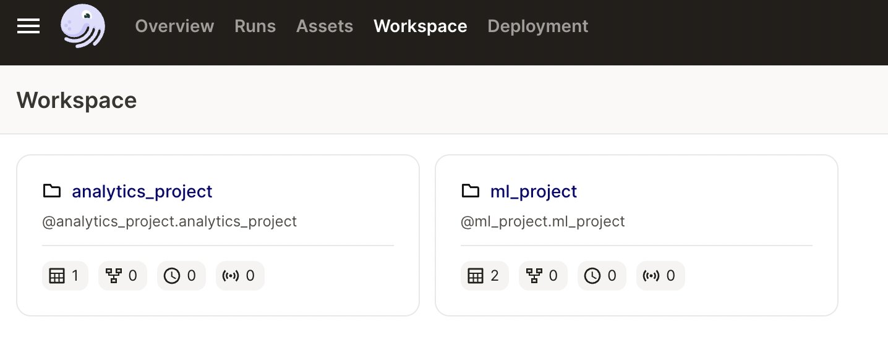

# DagTeam Data Engineering 

This repository houses the data engineering code for DagTeam. The repository contains multiple dagster projects:

```
dagteam
 - analytics_project
 - ml_project
```


The project structure allows each team to maintain their own code with its own Python dependencies. 
One team's code changes, or dependency upgrades, do not impact the other teams.

For example, to work within the analytics project:

```
cd analytics_project
source .venv-analytics/bin/activate
dagit
```

In addition to running dagit within their project, teams can confirm their code is loadable through tests:

```
cd analytics_project
pytest analytics_project_tests
======================== test session starts ==========================
platform darwin -- Python 3.10.7, pytest-7.2.0, pluggy-1.0.0
rootdir: /Users/lopp/Projects/dagteam/analytics_project
plugins: anyio-3.6.2
collected 1 item 

analytics_project_tests/test_project_loads.py .                 [100%]
======================== 1 passed in 0.55s =============================
```

These tests can be added to CI/CD prior to pushing any changes to production.

While the team's projects are separate, they can have shared assets. As an example: 

`ml_project/ml_project/assets/__init__.py`

```
# ML team depends on an asset from the analytics project
penguins = SourceAsset(key = AssetKey("penguins"))

@asset(
    group_name = "ml",
    compute_kind = "sklearn"
)
def penguin_cluster(penguins):
    ...
    return penguin_cluster
```


To run the entire global data platform:

```
# load the global virtual environment, which only contains dagit and dagster
source .venv-dagit
dagit
```

This global run uses `workspace.yaml` to load a virtualenv for analytics and a virtualenv for ml-project.



The Python dependencies for the orchestrator (dagster and dagit, contained in .venv-dagit) are _separate and isolated_ from all of the project code.

On Dagster Cloud the setup is similar, and `dagster_cloud.yaml` ensures each project is represented as a unique code location with its own dependencies.
